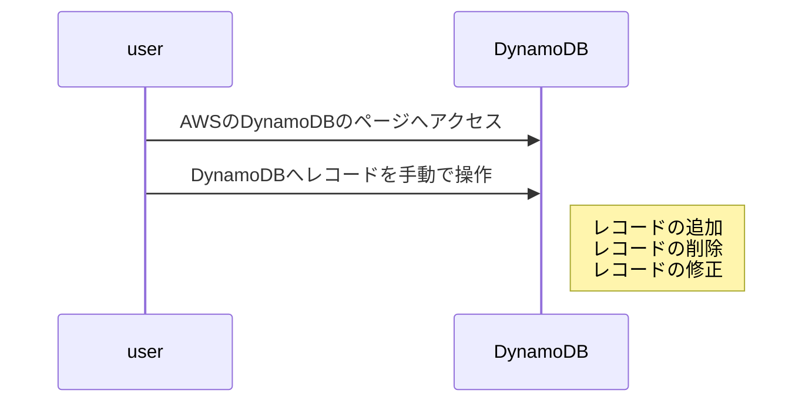
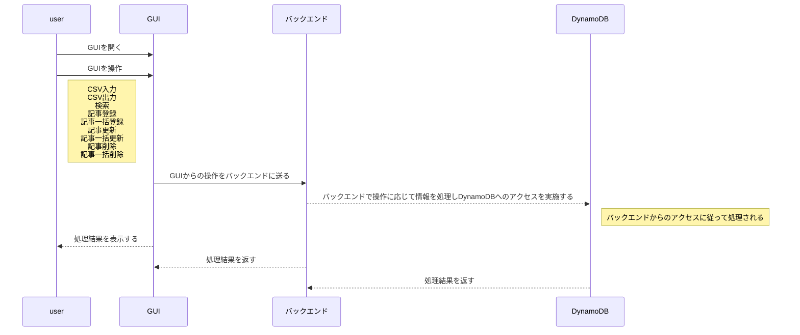

# Twitter Bot 業務要件

## 1. システム化の背景

当初、顧客からTwitterのBotを作成を依頼された、
その時点では、GUIが不要の最低限の機能を搭載したものでした。
この度、TwitterのBotのアップグレードを依頼された為、
顧客とヒアリングした顧客依頼内容を基本として再度システム化することになりました。

## 2.システム化の目的

- GUIを搭載し、操作性を高める
- 新機能の追加

## 3.システム化の範囲

- 新規機能としてGUIを搭載し登録、削除、更新、検索、CSVの出力、入力を追加する
- 既存のシステムでPythonやAWSの知識が必要だった操作をGUIを搭載すること、削除、登録、更新を知識がなくても実施できるようにする
- GUIの搭載、新機能の搭載によって作業時間の高速化する

## 4.現行の業務シーケンス

userは直接、AWSのDynamoDBへ直接アクセスし操作を実施している

## 5.システム化後のシーケンス

AWSのDynamoDBへ直接アクセスを不要にする

