# Twitter Bot 機能要件定義

## 1. システム方式

### 1-1. ソフトウェア構図

#### 1-1-1 Twitter Bot GUI

| 種類 | 内容 |
| - | - |
| フレームワーク | vue.js  |
| 言語 | js  |
| ソース管理 | AWS Code commit |
| ビルド | AWS CodeBuild |
| CI/CD | AWS CodePipeline |
| コンピューター処理 | AWS EC2 |
| 統合開発環境 | AWS Cloud9 |
| ネットワーク　|　Amazon VPC　|

 

#### 1-1-2 Twitter Bot サーバー

| 種類 | 内容 |
| - | - |
| フレームワーク | Spring Boot |
| 言語 | java |
| ソース管理 | AWS Code commit |
| ビルド | AWS CodeBuild |
| CI/CD | AWS CodePipeline |
| コンピューター処理 | AWS EC2 |
| 統合開発環境 | AWS Cloud9 |
| ネットワーク　|　Amazon VPC　|
 

#### 1-1-2 Twitter Bot データサーバー

| 種類 | 内容 |
| - | - |
| RDBMS | Amazon Aurora |
| データベース| PostgreSQL  |
| ソース管理 | AWS Code commit |
| ビルド | AWS CodeBuild |
| CI/CD | AWS CodePipeline |
| 統合開発環境 | AWS Cloud9 |

 

#### 1-1-3 Twitter Bot バッチ

| 種類 | 内容 |
| - | - |
| コンピューター処理 | AWS lambda |
| データベース| PostgreSQL  |
| 言語 | Python |
| RDBMS | Amazon Aurora |
| ソース管理 | AWS Code commit |
| ビルド | AWS CodeBuild |
| CI/CD | AWS CodePipeline |
| 統合開発環境 | AWS Cloud9 |

 

## 2.画面要件

### 2-1.画面一覧

| No. | 画面名 | 説明 | 備考 |
| - | - | - | - |
| 1 | ホーム画面 | 記事の登録画面や記事一覧画面などに遷移できる。 |  |
| 2 | 記事一覧画面 | 記事一覧を表示する画面。記事の編集、検索などが可能。 |  |

 

### 2-1.画面遷移図

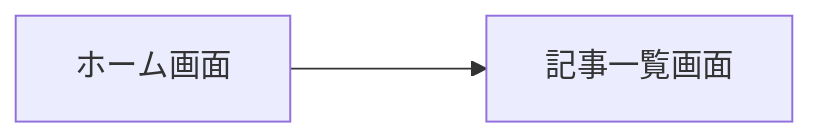

### 2-2.画面レイアウト

「画面レイアウト」参照

## 3.機能一覧

| No | 画面名 | 機能名 | 機能詳細 | 備考 |
| - | - | - | - | - |
| 1-1 | ホーム画面 | 記事一覧画面遷移 | 記事一覧画面に遷移する | |
| 2-1 | 記事一覧画面 | CSV入力 | CSVファイルからの記事記事の取込み  | |
| 2-2 | - | CSV出力 | 記事記事をCSVファイルで出力する | |
| 2-3 | - | 検索 | 記事を検索する |  |
| 2-4 | - | 記事登録 | 記事内容、本文、URL、タグを登録する | |
| 2-5 | - | 記事一括登録 | 記事内容、本文、URL、タグを一括登録する | |
| 2-6 | - | 記事更新 | 記事内容、本文、URL、タグを編集する | |
| 2-7 | - | 記事一括更新 | 記事内容、本文、URL、タグを一括編集する | |
| 2-8 | - | 記事削除 | 登録した記事内容を削除する | |
| 2-9 | - | 記事一括削除| 登録した記事内容を一括削除する | |
| 3 | - | バッチ処理 | Twitterに一定期間で記事を投稿する | |
 

## 4.ビジネスプロセスフロー

図1を基本とします。
図1の情報から細分化したプロセスフローを記載致します。

 

図1: ビジネスプロセス関連図

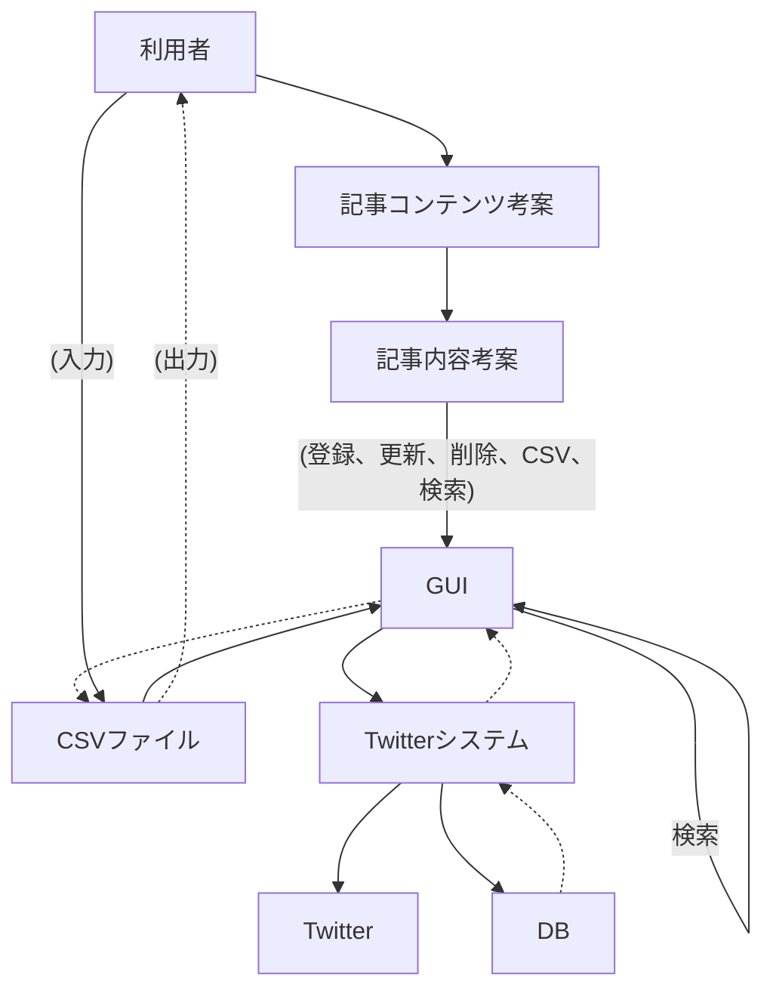

 

図2: 2-1 CSV入力

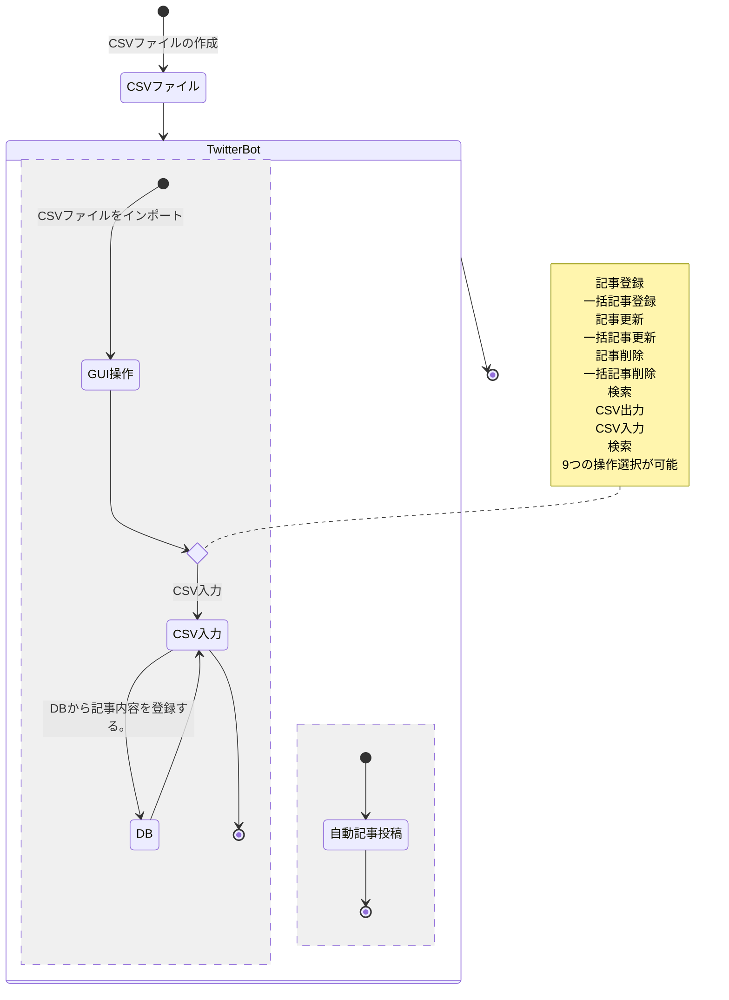

 

図3: 2-2 CSV出力

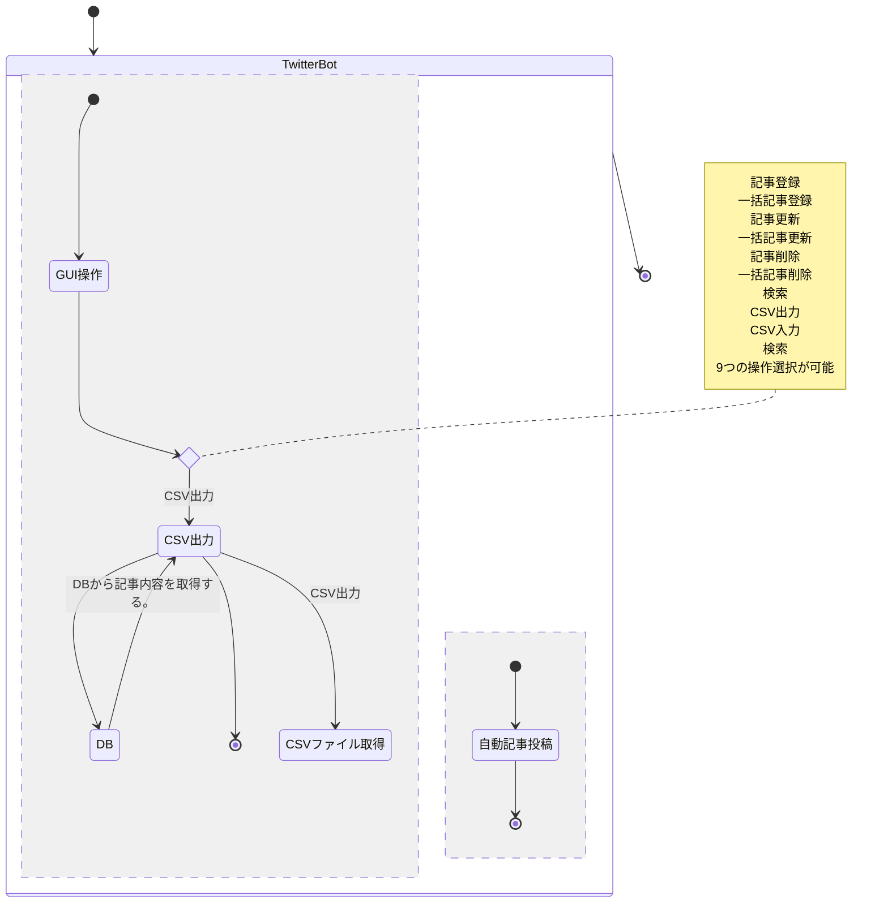

 

図4: 2-3 検索

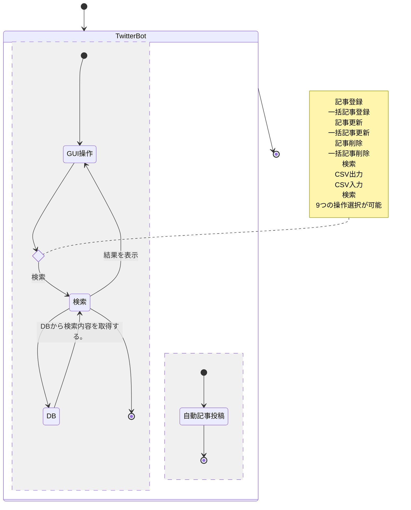

 
図5: 2-4、2-5 記事登録、記事一括登録
記事登録と記事一括登録は同じロジックになる。

 

図6: 2-6、2-7 記事更新、記事一括更新
記事更新と記事一括更新は同じロジックになる。

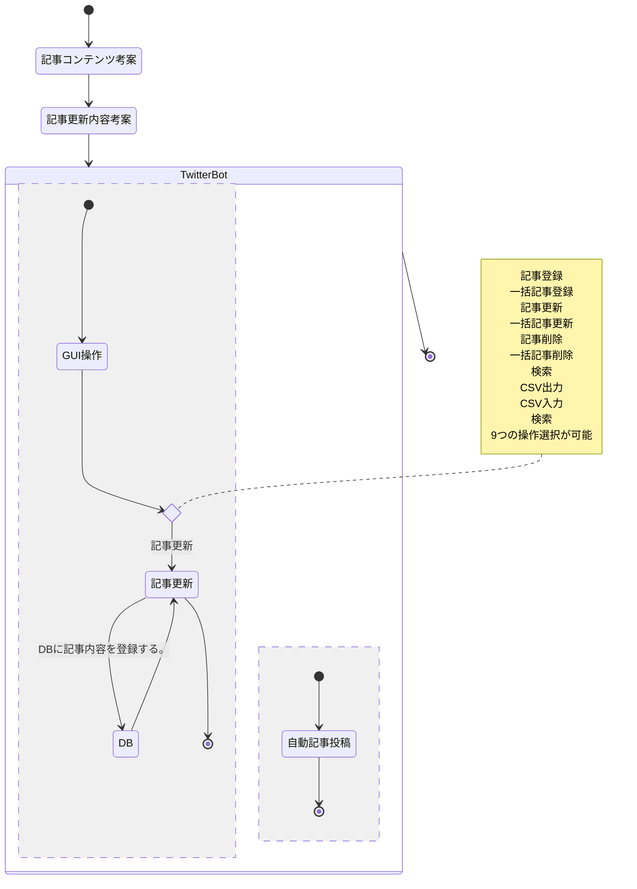

 

図7: 2-8、2-9 記事削除、記事一括削除
記事削除と記事一括削除は同じロジックになる。

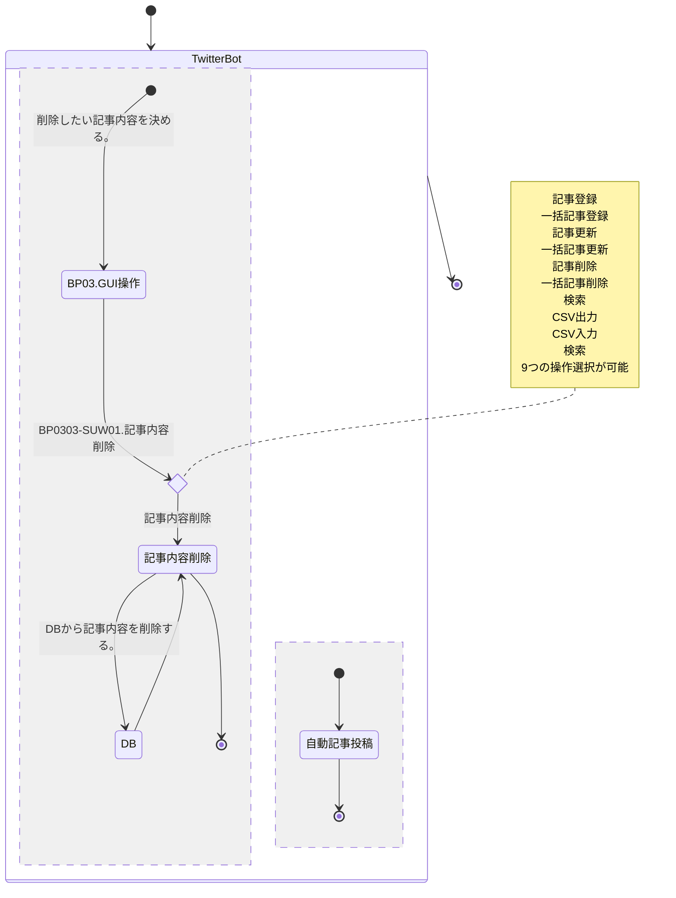

 

図8: バッチ
業務フローが存在しない為、未記入

## 5.システム化業務フロー

図1を基本とします。
図1の情報から細分化したシステム化業務フローを記載致します。

 

図1: ビジネスプロセス関連図

 

図2: CSV入力

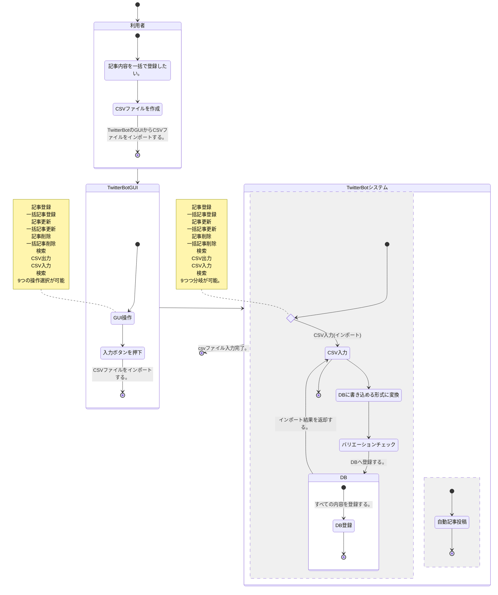

 

図3: CSV出力

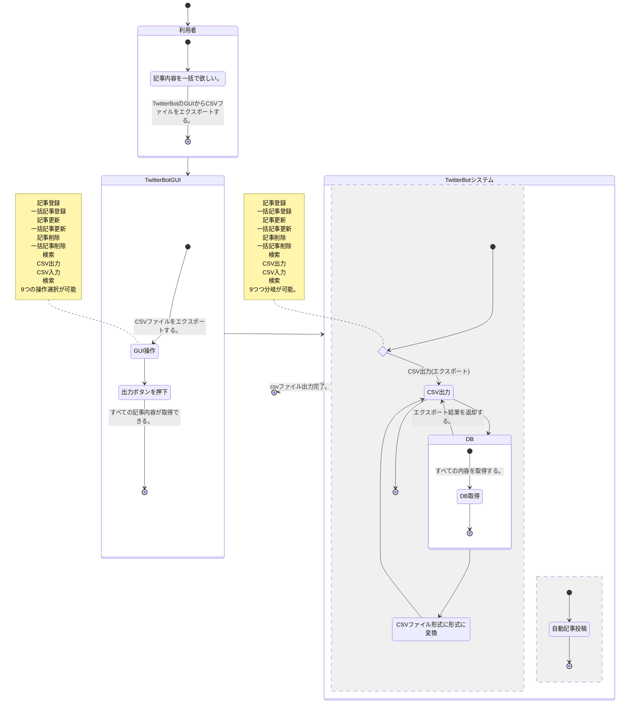

 

図4: 検索

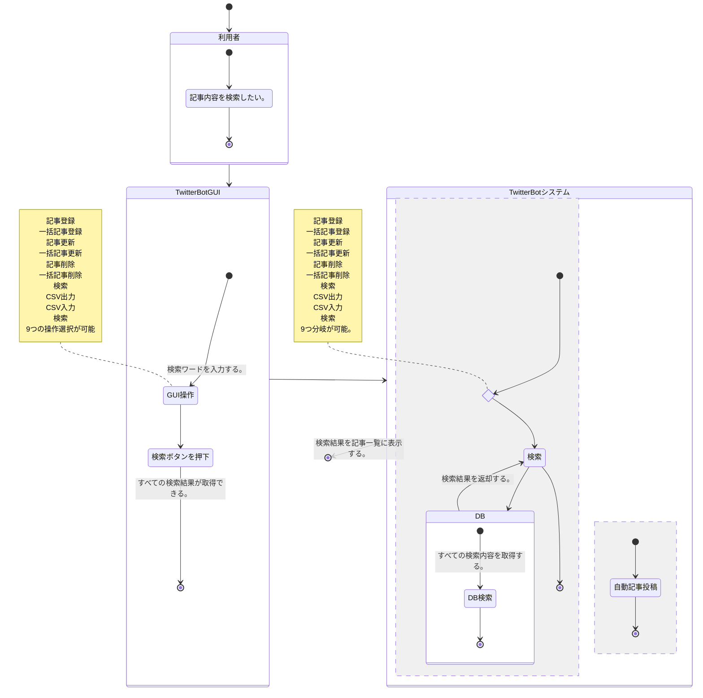

 

図5: 記事登録、記事一括登録
記事登録と記事一括登録は同じロジックになる。

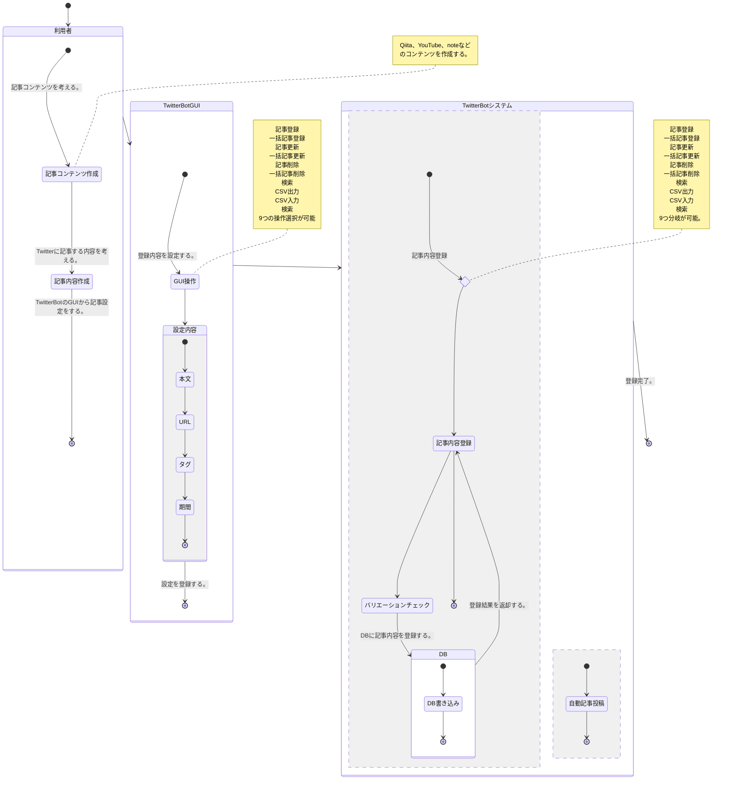

 

図6: 記事更新、記事一括更新
記事更新と記事一括更新は同じロジックになる。

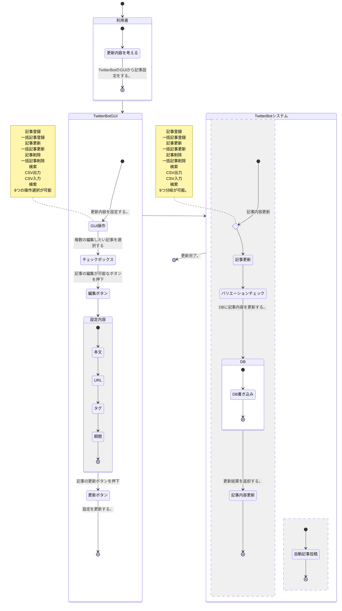

 

図7: 記事削除
記事削除と記事一括削除は同じロジックになる。

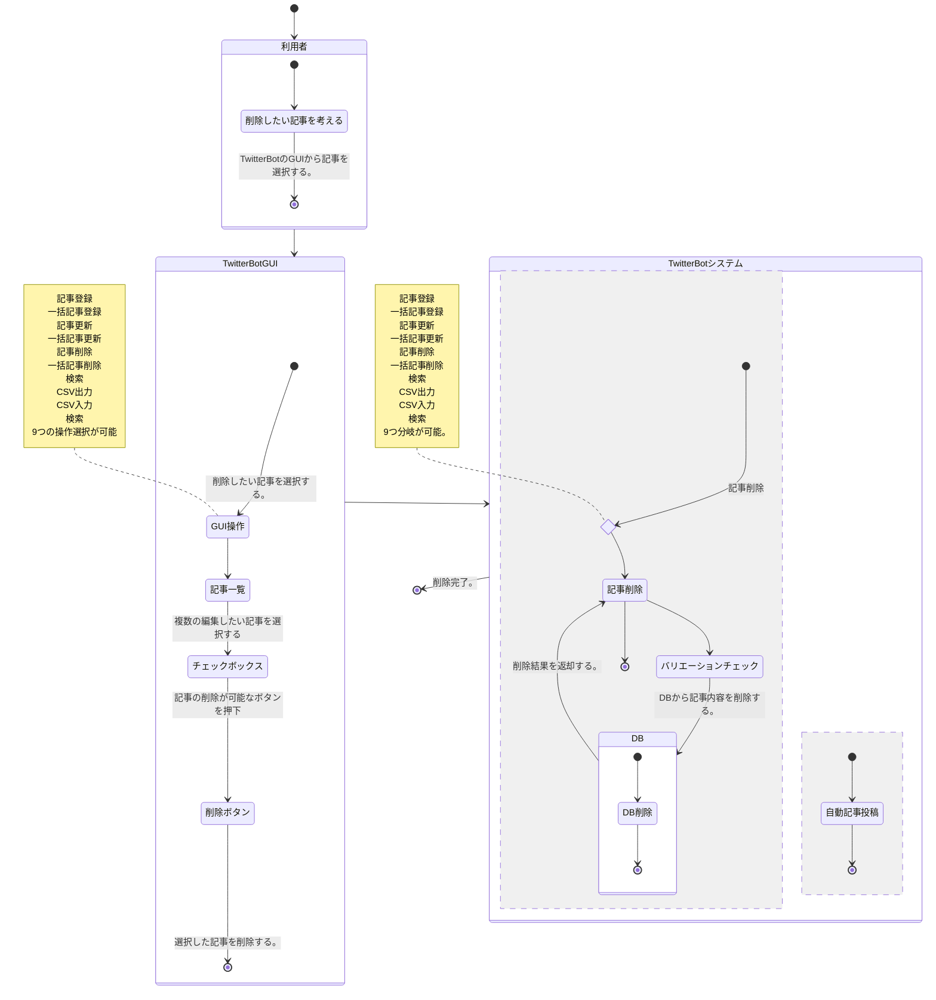

 

図8: バッチ
システム化業務フローが存在しない為、未記入

## 6.業務処理定義

### 業務処理

#### 1.CSV入力

| ビジネスプロセス |
| - | - | - |
| CSV入力 |

1. 概要
   1. 目的   GUIを利用しCSVファイルを読み込ませて記事内容を登録する。
   2. 流れ  利用者がGUI上からCSVファイルインポートする。

2. 業務処理説明
   1. Input（入力）：利用者のCSV入力操作。
   2. Process（処理）：DBの情報をCSVファイルの情報のバリエーションチェックをした後、登録をする。
   3. output（出力）： 処理で失敗した場合は、失敗したエラー内容が表示される。  登録　に成功した場合は、成功したという内容が表示される。

3. バリエーションチェック

    | 項目 | 制限 |　エラー内容 |
    | - | - | - |
    | 記事本文 |タグと合わせて文字数が全角125文字/半角255文字以内。 |記事可能な文字数をオーバーしていることを伝えるメッセージを表示。　 |
    | タグ| タグと合わせて文字数が全角125文字/半角255文字以内。 | 記事可能な文字数をオーバーしていることを伝えるメッセージを表示。　 |
    | タグ| ＃記号とスペースの半角2文字| タグの形式が不正であることを伝　えるメッセージを表示。|
    | URL |  RFC 3986 | URLが不正であることを伝えるメッセージを表示。 |
    | DB |  同じ登録内容が存在しないこと。 | あることを伝えるメッセージを表示。 |
    
 

#### 2.CSV出力

|　ビジネスプロセス |
| - | - | - |
| CSV出力 |

1. 概要
   1. 目的   GUIを利用し記事内容のCSVファイルを取得する。
   2. 流れ  利用者がGUI上からCSVファイル取得する。

2. 業務処理説明
   1. Input（入力）：利用者のCSV取得操作。
   2. Process（処理）：DBの情報をCSVファイル形式で出力する。
   3. output（出力）： 処理で失敗した場合は、失敗したエラー内容が表示される。  出力に成功した場合は、成功したという内容が表示される。

　 

#### 3.検索

|　ビジネスプロセス |
| - | - | - |
| 検索 |

1. 概要
   1. 目的   GUIを利用し検索ワードから記事一覧を取得する。
   2. 流れ  利用者がGUI上から検索ワードを入力し検索ボタンを押下。

2. 業務処理説明
   1. Input（入力）：利用者の検索ワード。
   2. Process（処理）：DBから情報を検索ワードで取得する。
   3. output（出力）： 処理で失敗した場合は、失敗したエラー内容が表示される。  取得に成功した場合は、検索結果が記事一覧に表示される。

　 

#### 4.記事登録、記事一括登録

| ビジネスプロセス |
| - | 
| 記事登録 |

1. 概要
   1. 目的   GUIを利用した記事内容の登録。
   2. 登録の流れ  利用者がGUI上から登録したい記事内容を記載し登録をおこなう。

2. 業務処理説明
   1. Input（入力）：利用者は、自動記事投稿したい記事内容を入力する。
   2. Process（処理）：登録された、情報は、バリエーションチェックをおこない、DBに登録される。
   3. output（出力）：     処理で失敗した場合は、失敗したエラー内容が表示される。  登録に成功した場合は、成功したという内容が表示される。登録された記事が追加される。

     

3. バリエーションチェック

    | 項目 | 制限 |　エラー内容 |
    | - | - | - |
    | 記事本文 |タグと合わせて文字数が全角125文字/半角255文字以内。 |記事可能な文字数をオーバーしていることを伝えるメッセージを表示。　 |
    | タグ| タグと合わせて文字数が全角125文字/半角255文字以内。 | 記事可能な文字数をオーバーしていることを伝えるメッセージを表示。　 |
    | タグ| ＃記号とスペースの半角2文字| タグの形式が不正であることを伝えるメッセージを表示。|
    | URL |  RFC 3986 | URLが不正であることを伝えるメッセージを表示。 |
    | 期間| 西暦以外　| 西暦を入力する趣旨のメッセージを表示。|
    | 期間| 過去　| 未来の日付を入力する趣旨のメッセージを表示。|
    | 期間| 終了日が開始日より過去　|  終了日が開始日より過去を入力する趣旨のメッセージを表示。|

 

#### 5.記事更新、記事一括更新

| ビジネスプロセス |
| - | 
| 記事更新 |

1. 概要
   1. 目的   GUIを利用した記事内容の編集、更新。
   2. 更新の流れ  利用者がGUI上から編集したい記事内容を選択し編集ボタン押下。編集後、更新ボタンを押下。

2. 業務処理説明
   1. Input（入力）：利用者は、すでに登録済みの自動記事投稿したい記事内容を編集する。
   2. Process（処理）：更新された、情報は、バリエーションチェックをおこない、DBが更新される。
   3. output（出力）： 処理で失敗した場合は、失敗したエラー内容が表示される。  更新に成功した場合は、成功したという内容が表示される。更新対象の記事が記事一覧から更新される。

     

3. バリエーションチェック

    | 項目 | 制限 |　エラー内容 |
    | - | - | - |
    | 記事本文 |タグと合わせて文字数が全角125文字/半角255文字以内。 |記事可能な文字数をオーバーしていることを伝えるメッセージを表示。　 |
    | タグ| タグと合わせて文字数が全角125文字/半角255文字以内。 | 記事可能な文字数をオーバーしていることを伝えるメッセージを表示。　 |
    | タグ| ＃記号とスペースの半角2文字| タグの形式が不正であることを伝　えるメッセージを表示。|
    | URL |  RFC 3986 | URLが不正であることを伝えるメッセージを表示。 |
    | 期間| 西暦以外　| 西暦を入力する趣旨のメッセージを表示。|
    | 期間| 期間過去　| 期間を修正した場合、未来の日付を入力する趣旨のメッセージを表示。|
    | 期間| 終了日が開始日より過去　|  終了日が開始日より過去を入力する趣旨のメッセージを表示。|

 

#### 6.記事削除、記事一括削除

| ビジネスプロセス | 
| - | 
| 記事削除 | 

1. 概要
   1. 目的   GUIを利用した記事内容の削除。
   2. 更新の流れ  利用者がGUI上から削除したい記事を選択し削除ボタンを押下。

2. 業務処理説明
   1. Input（入力）：利用者は、削除したい記事を選択する。
   2. Process（処理）：削除したい記事内容は、バリエーションチェックをおこない、DBが削除される。
   3. output（出力）： 処理で失敗した場合は、失敗したエラー内容が表示される。  削除に成功した場合は、成功したという内容が表示される。記事一覧から削除される。

     

3. バリエーションチェック

    | 項目 | 制限 |　エラー内容 |
    | - | - | - |
    | DB | DBから既に削除されていないか。 |　既に削除されていることが伝わるメッセージを表示。　 |

 

#### 7.バッチ

ビジネスプロセスが存在しない為、未記入
