# Twitter Bot 画面レイアウト

## 1. 画面要件

画面の画面一覧の画面レイアウトを記載する。

## 2.画面一覧

| No. | 画面名 | 説明 | 備考 |
| - | - | - | - |
| 1 | ホーム画面 | 記事の登録画面や記事一覧画面などに遷移できる。 |  |
| 2 | 記事一覧画面 | 記事一覧を表示する画面。記事の編集、検索などが可能。 |  |

## 3.画面レイアウト

### 3.1. ホーム画面

アプリを起動した際に一番最初に開く画面。

※カラーは、実装時にトーンバランスを検討しながら決定

| No. | 機能 | 説明 | 備考 |
| - | - | - | - |
| 1 | スライド | 使い方についてのスライドを表示する |  |
| 2 | 記事一覧ボタン | 記事一覧画面に遷移する |  |

### 3.2. 記事一覧画面

※カラーは、実装時にトーンバランスを検討しながら決定

| No. | 機能 | 説明 | 備考 |
| - | - | - | - |
| 1 | スクロール | 横幅のスクロール |  |
| 2 | スクロール | 縦幅のスクロール |  |
| 3 | チェックボックス | すべてのチェックボックスが選択、解除される |  |

#### 3.2.1. 記事一覧(CSV入力)画面

.drawio.svg)
※カラーは、実装時にトーンバランスを検討しながら決定

| No. | 機能 | 説明 | 備考 |
| - | - | - | - |
| 1 | インポート | インポートボタン、ファイルのエクスプローラーが開く |  |
| 2 | 完了ポップアップ | 処理が成功した際にポップアップを表示させる |  |
| 3 | 失敗ポップアップ | 処理が失敗した際にポップアップを表示させる |  |

#### 3.2.2. 記事一覧(CSV出力)画面

.drawio.svg)
※カラーは、実装時にトーンバランスを検討しながら決定

| No. | 機能 | 説明 | 備考 |
| - | - | - | - |
| 1 | エクスポート | エクスポートボタン、CSVファイルが出力される |  |
| 2 | 完了ポップアップ | 処理が成功した際にポップアップを表示させる |  |
| 3 | 失敗ポップアップ | 処理が失敗した際にポップアップを表示させる |  |

#### 3.2.3. 記事一覧(検索)画面

.drawio.svg)
※カラーは、実装時にトーンバランスを検討しながら決定

| No. | 機能 | 説明 | 備考 |
| - | - | - | - |
| 1 | フィルタボタン | 検索条件のポップアップが開く |  |
| 2 | 検索フィールド | 入力しエンターキーで検索できる |  |
| 3 | 検索フィールド | 検索したい内容を入力する |  |
| 4 | 開始日 | カレンダーのポップアップが表示され開始日を入力できる |  |
| 5 | 終了日 |　カレンダーのポップアップが表示され終了日を入力できる |  |
| 6 | 検索ボタン | ポップアップが閉じ検索結果が表示される |  |
| 7 | 完了ポップアップ | 処理が成功した際にポップアップを表示させる |  |
| 8 | 失敗ポップアップ | 処理が失敗した際にポップアップを表示させる |  |

#### 3.2.4. 記事一覧(登録)画面

.drawio.svg)
※カラーは、実装時にトーンバランスを検討しながら決定
※記事一括登録も同じ画面です

| No. | 機能 | 説明 | 備考 |
| - | - | - | - |
| 1 | 追加ボタン | レコードを追加する |  |
| 2 | レコード | 追加ボタンで1行のレコードが追加される |  |
| 3 | 登録ボタン | 登録処理をおこなう |  |
| 4 | 完了ポップアップ | 処理が成功した際にポップアップを表示させる |  |
| 5 | 失敗ポップアップ | 処理が失敗した際にポップアップを表示させる |  |
| 6 | 失敗原因 | 失敗原因のカラムを主張する  |  |

#### 3.2.5. 記事一覧(更新)画面

.drawio.svg)
※カラーは、実装時にトーンバランスを検討しながら決定
※記事一括更新も同じ画面です

| No. | 機能 | 説明 | 備考 |
| - | - | - | - |
| 1 | レコード | レコードをクリックすると編集が可能になる |  |
| 2 | チェックボックス | 1でクリックされたレコードにチェックが付く |  |
| 3 | 更新ボタン | 更新処理をおこなう |  |
| 4 | 完了ポップアップ | 処理が成功した際にポップアップを表示させる |  |
| 5 | 失敗ポップアップ | 処理が失敗した際にポップアップを表示させる |  |
| 6 | 失敗原因 | 失敗原因のカラムを主張する  |  |

#### 3.2.5. 記事一覧(削除)画面

.drawio.svg)
※カラーは、実装時にトーンバランスを検討しながら決定
※記事一括削除も同じ画面です

| No. | 機能 | 説明 | 備考 |
| - | - | - | - |
| 1 | チェックボックス | 1でクリックされたレコードにチェックが付く |  |
| 2 | 削除ボタン | チェックされたレコードを削除処理をおこなう |  |
| 3 | 完了ポップアップ | 処理が成功した際にポップアップを表示させる |  |
| 4 | 失敗ポップアップ | 処理が失敗した際にポップアップを表示させる |  |
