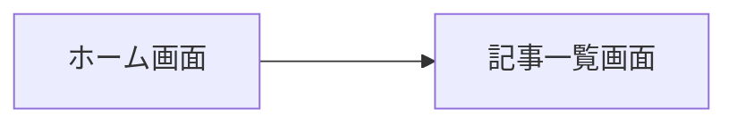
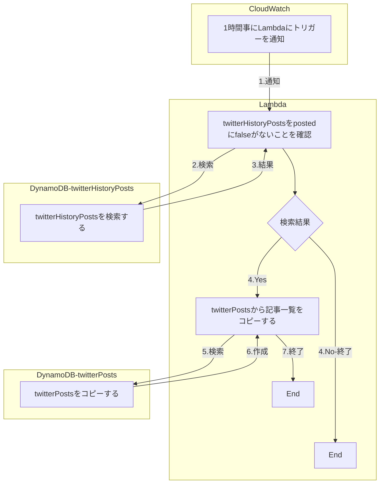

# Twitter Bot 基本設計

## 1. システム設計

## 2. 画面設計

| No. | 画面名 | 説明 | 備考 |
| - | - | - | - |
| 1 | ホーム画面 | 記事の登録画面や記事一覧画面などに遷移できる。 |  |
| 2 | 記事一覧画面 | 記事一覧を表示する画面。記事の編集、検索などが可能。 |  |

### 2.1. 画面レイアウト

図1.ホーム画面

図2.記事一覧

詳細については、「画面設計」参照

### 2.2. 画面遷移図

## 3. バッチ設計

cloud watchから定期的トリガーを通知しLambdaを実行しTwitterに記事を投稿する。

### 3.1. バッチ処理一覧

| No | 機能名 | 機能詳細 | 備考 |
| - | - | - | - | - |
| 1 | 記事一覧コピー | twitterPostsからtwitterHistoryPostsへ記事一覧をコピーする | - |
| 2 | 記事投稿 | cloud watchからlambdaへトリガーをを定期的に実行しTwitterに記事を投稿する | - |

### 3.2. バッチ処理フロー

## 4. テーブル・ファイル要件

### 4.1.テーブル一覧

| No. |テーブル名 | 説明 | 備考 |
| - | - | - | - |
| 1 | twitterPosts | twitterに投稿する記事の一覧 | - |
| 2 | twitterHistoryPosts | 1レコードずつ投稿していく | - |

詳細については、「データベース定義」参照

### 4.2. ファイル要件

| No. | ファイル | 説明 | 備考 |
| - | - | - | - |
| 1 | 入力用のテンプレートファイル | 記事の一括登録をおこなう為のCSVファイルのテンプレート | - |
| 2 | 出力用のテンプレートファイル | 記事の一括出力をおこなう為のCSVファイルのテンプレート | 1と形式は、同様 |

フォーマットについては、「template.csv」参照

### 4.3. CRUD図

- 画面操作

| \ | twitterPostsテーブル | twitterHistoryPostsテーブル |
| - | - | - |
| CSV入力 | C | - |
| CSV出力 | R | - |
| 検索 | R | - |
| 登録 | RC | - |
| 更新 | RU | - |
| 削除 | RD | - |

- バッチ
  
| \ | twitterPostsテーブル | twitterHistoryPostsテーブル |
| - | - | - |
| 登録 | R | CR |