# Twitter Bot 画面設計

## 1. 画面要件

画面の画面一覧と画面設計を記載する。

## 2.画面一覧

| No. | 画面名 | 説明 | 備考 |
| - | - | - | - |
| 1 | ホーム画面 | 記事の登録画面や記事一覧画面などに遷移できる。 |  |
| 2 | 記事一覧画面 | 記事一覧を表示する画面。記事の編集、検索などが可能。 |  |

## 3.画面レイアウト

### 3.1. ホーム画面

アプリを起動した際に一番最初に開く画面。

| No. | ラベル | 種類 | 表示範囲 | 説明 | 備考 |
| - | - | - | - | - | - |
| ① | Twitter Bot | テキスト | - | システムの名称 | - |
| ② | - | スライダー | - | システムの使用方法をスライダー | - |
| ③ | 記事一覧 | ボタン | - | 記事一覧画面に遷移する | - |
| ④ | - | ページャー | - |  スライダーのページャーを表示する  | - |

#### 3.1.1. 操作手順

- パターン1

1. ②で使用手順を確認する
2. ③のボタンを押下する

#### 3.1.2. 画面アクション

| No. | 画面名 | アクション名 | イベント名 | アクション処理の概要 | 入力| アクション処理詳細 | 遷移先画面 | 出力 |
| - | - | - | - | - | - | - | - | - |
| 1 | ホーム画面 | 画面遷移 | 記事一覧画面へ遷移 | 記事一覧情報を取得し記事一覧画面に遷移する| twitterPostsテーブル |① 検索処理  twitterPostsからすべての記事を取得する| - | - |
| - | - | - | - | - | - |② ①で取得したデータを表示できる形式に修正する　| - | - |
| - | - | - | - | - | - |③-1 処理に成功した場合　| - | 成功メッセージ |
| - | - | - | - | - | - |③-2 処理に失敗した場合　| - | 失敗メッセージ |
| - | - | - | - | - | - |④ 表示する　| 記事一覧画面 | 記事一覧 |

### 3.2. 記事一覧画面

| No. | ラベル | 種類 | 表示範囲 | 説明 | 備考 |
| - | - | - | - | - | - | 
| ① | Twitter Bot | テキスト | - | システムの名称 | - |
| ② | - | - | - |　最大10列を表示する | - |
| ③ | - | スクロールバー | - | 横のスクロールバー、見切れた記事内容を表示する | - |
| ④ | - | ページャー | - |  記事一覧のページャーを表示する  | - |

#### 3.2.1. 操作手順

- パターン1

1. ③ページが見切れている時にスクロールする
2. ④ページを移動するページャー

### 3.3. 記事一覧(CSV入力)画面

設計.drawio.svg)
・

| No. | ラベル | 種類 | 表示範囲 | 説明 | 備考 |
| - | - | - | - | - | - | 
| ① | CSV | ボタン | - | インポートボタン押下とエクスプローラーが開く | - |
| ② | CSVファイルのインポートが完了しました。| ポップアップ | - | 処理が成功した際にポップアップを表示させる | - |
| ③ | CSVファイルのインポートが失敗しました。 | ポップアップ| - | 処理が失敗した際にポップアップを表示させる | - |

#### 3.3.1. 操作手順

1. ①ボタンを押下しファイルエクスプローラーが開く
2. インポートしたいファイルを選択する

#### 3.3.2. 画面アクション

| No. | 画面名 | アクション名 | イベント名 | アクション処理の概要 | 入力| アクション処理詳細 | 遷移先画面 | 出力 |
| - | - | - | - | - | - | - | - | - |
| 1 | 記事一覧画面 | CSV入力　|  CSVファイルのインポート | CSVファイルの記事一覧をインポートする | CSVファイル | ① CSVファイルをと読み込む | - | - |
| - | - | -|  - | - | - |② ① 読み込んだファイルをのバリエーションチェックをおこなう | - | - |
| - | - | -|  - | - | - |③ ① チェックした情報をDBへ書き込める形式に変換する | - | - |
| - | - | -|  - | - | twitterPostsテーブル | ④ 書き込み処理　③変換した情報をDBへ書き込む 既に存在するデータと一致するものは書き込まない | - | - |
| - | -  | -  | -  | - | - |⑤ 検索処理  twitterPostsからすべての記事を取得する| - | - |
| - | - | - | - | - | - |⑥ ⑤で取得したデータを表示できる形式に修正する　| - | - |
| - | - | - | - | - | - |⑦-1 処理に成功した場合　| - | 成功メッセージ |
| - | - | - | - | - | - |⑦-2 処理に失敗した場合　| - | 失敗メッセージ |
| - | - | - | - | - | - |⑧ 表示する　| - | 記事一覧 |

### 3.4. 記事一覧(CSV出力)画面

設計.drawio.svg)

| No. | ラベル | 種類 | 表示範囲 | 説明 | 備考 |
| - | - | - | - | - | - | 
| ① | CSV | ボタン | - | エクスポートボタン、CSVファイルが出力される | - |
| ② | CSVファイルのエクスポートが完了しました。| ポップアップ | - | 処理が成功した際にポップアップを表示させる | - |
| ③ | CSVファイルのエクスポートが失敗しました。 | ポップアップ| - | 処理が失敗した際にポップアップを表示させる | - |

#### 3.4.1. 操作手順

- パターン1
  
1. ①ボタンを押下と記事一覧のCSVファイルが出力される

#### 3.4.2. 画面アクション

| No. | 画面名 | アクション名 | イベント名 | アクション処理の概要 | 入力| アクション処理詳細 | 遷移先画面 | 出力 |
| - | - | - | - | - | - | - | - | - |
| 1 | 記事一覧画面 | CSV出力　|  CSVファイルのエクスポート | CSVファイルの記事一覧をエクスポートする | twitterPostsテーブル |① 検索処理 twitterPostsからすべての記事を取得する| -| - |
| - | - | - | - | - | - |② ①で取得したデータをCSV出力できる形式に修正する　| - | - |
| - | - | - | - | - | - |③-1 処理に成功した場合　| - | 成功メッセージ |
| - | - | - | - | - | - |③-2 処理に失敗した場合　| - | 失敗メッセージ |
| - | - | - | - | - | - |④ 出力する　| - | CSVファイル |

#### 3.5. 記事一覧(検索)画面

設計.drawio.svg)

| No. | ラベル | 種類 | 表示範囲 | 説明 | 備考 |
| - | - | - | - | - | - |
| ① | - | ボタン | - | 検索条件のポップアップが開く | - |
| ② | - | フィールド | 15文字以内 | 入力しエンターキーで検索できる | - |
| ③ | - | ボタン | - | 検索用のポップアップが閉じる | - |
| ④ | 検索 | テキスト | - | 検索フィールドのラベル | - |
| ⑤ | - | フィールド | 15文字以内 | 検索したい内容を入力する | - |
| ⑥ | 期間 | テキスト |　- | 期間フィールドのラベル | - |
| ⑦ | - | ボタン | - |  カレンダーのポップポップアップが開く | - |
| ⑧ | 開始日 | フィールド| - | カレンダーのポップアップが表示され開始日を入力できる | - |
| ⑨ | ~ | テキスト |　- | 期間フィールドの間のラベル | - |
| ⑪ |　終了日| フィールド | - |　カレンダーのポップアップが表示され終了日を入力できる | - |
| ⑫ | 検索 | ボタン | - | ポップアップが閉じ検索結果が表示される | - |
| ⑬ | 検索が完了しました。| ポップアップ | - | 処理が成功した際にポップアップを表示させる | - |
| ⑭ | 検索が失敗しました。| ポップアップ | - | 処理が失敗した際にポップアップを表示させる | - |

#### 3.5.1. 操作手順

・パターン1

1. ①のボタンを押下
2. ⑤に検索したいワードを入力する 
3. ⑫のボタンを押下
4. 検索結果が表示される

・パターン2

1. ①のボタンを押下
2. ⑧、⑪に期間を入力する 
3. ⑫のボタンを押下
4. 検索結果が表示される

・パターン3

1. ①のボタンを押下
2. ⑤に検索したいワードを入力する
3. ⑧、⑪に期間を入力する
4. ⑫のボタンを押下
5. 検索結果が表示される

・パターン4

1. ②に検索したいワードを入力する
2. エンターキーを入力
3. 検索結果が表示される

#### 3.5.2. 画面アクション

| No. | 画面名 | アクション名 | イベント名 | アクション処理の概要 | 入力| アクション処理詳細 | 遷移先画面 | 出力 |
| - | - | - | - | - | - | - | - | - |
| 1 | 記事一覧画面 | 検索| 記事検索 | 検索条件で検索する | 検索ワード | ① 検索ワードをバリエーションチェックする　 | - | - | - | - |
| - | - | -| - | - | twitterPostsテーブル | ②検索処理  検索条件でtwitterPostsから情報を取得する　 | - | - | - | - |
| - | - | - | - | - | - |③ ①で取得したデータを表示できる形式に修正する　| - | - |
| - | - | - | - | - | - |④-1 処理に成功した場合　| - | 成功メッセージ |
| - | - | - | - | - | - |④-2 処理に失敗した場合　| - | 失敗メッセージ |
| - | - | - | - | - | - |⑤ 表示する　| - | 記事一覧 |

### 3.6. 記事一覧(登録)画面

設計.drawio.svg)

※記事一括登録も同じ画面です

| No. | ラベル | 種類 | 表示範囲 | 説明 | 備考 |
| - | - | - | - | - | - |
| ① |　追加 | ボタン | -| レコードを追加する | - |
| ② | - |　フィールド | - | 追加ボタンで1行のレコードが最後尾に追加される | - |
| ③ | - | ページャー | - | 追加ボタンで最後のページに遷移する | - |
| ④ | 登録 | ボタン | - | 登録処理をおこなう | - |
| ⑤ | 登録が完了しました。|ポップアップ| - |処理が成功した際にポップアップを表示させる | - |
| ⑥ | -|フィールド| - |失敗原因のカラムを主張する  |  -|
| ⑦ | 登録に失敗しました。|ポップアップ| - | 処理が失敗した際にポップアップを表示させる | - |

#### 3.6.1. 操作手順

- パターン1

1. ①のボタンを押下
2. ②のフィールドに入力する
3. ④のボタンを押下
4. 登録結果が表示される

#### 3.6.2. 画面アクション

| No. | 画面名 | アクション名 | イベント名 | アクション処理の概要 | 入力| アクション処理詳細 | 遷移先画面 | 出力 |
| - | - | - | - | - | - | - | - | - |
| 1 | 記事一覧 | 登録 | 記事登録 | 記事を追加する | 追加 |① フィールドが追加される| - | - |
| - | - | - | - | - | - |② ①フィールドに値を入力する | - | - |
| - | - | - | - | - | - |③ 登録ボタンを押下 | - | - |
| - | - | - | - | - | - |④ ②の値をバリエーションチェックする | - | - |
| - | - | - | - | - | twitterPostsテーブル | ⑤ 書き込み処理  ④の値をDBに書き込む 既に存在するデータと一致するものは書き込まない | - | - |
| - | - | - | - | - | - |⑥ 検索処理  twitterPostsからすべての記事を取得する| - | -|
| - | - | - | - | - | - |⑦ ⑥で取得したデータを表示できる形式に修正する　| - | - |
| - | - | - | - | - | - |⑧-1 処理に成功した場合　| - | 成功メッセージ |
| - | - | - | - | - | - |⑧-2 処理に失敗した場合　| - | 失敗メッセージ |
| - | - | - | - | - | - |⑨ 表示する　| - | 記事一覧 |

### 3.7. 記事一覧(更新)画面

設計.drawio.svg)
※記事一括更新も同じ画面です

| No. | ラベル | 種類 | 表示範囲 | 説明 | 備考 |
| - | - | - | - | - | - |
| ① | - | フィールド| - | フィールドをクリックすると編集が可能になる | クリックし編集すると登録ボタンから更新ボタンへ変化する |
| ① | - |チェックボックス | - | 1でクリックされたレコードにチェックが付く | - |
| ② | 更新 | ボタン | - | 更新処理をおこなう | - |
| ③ | 更新が完了しました。| ポップアップ | -| 処理が成功した際にポップアップを表示させる | - |
| ④ | - |フィールド| - | 失敗原因のカラムを主張する  | - |
| ⑤ | 更新に失敗しました。| ポップアップ| - | 処理が失敗した際にポップアップを表示させる | - |

#### 3.7.1. 操作手順

- パターン1

1. フィールドを選択する
2. フィールドを編集する
3. ②のボタンを押下
4. 更新結果が表示される

#### 3.7.2. 画面アクション

| No. | 画面名 | アクション名 | イベント名 | アクション処理の概要 | 入力| アクション処理詳細 | 遷移先画面 | 出力 |
| - | - | - | - | - | - | - | - | - |
| 1 | 記事一覧 | 更新 | 記事更新 | 記事を修正する | ファイルをクリック |① フィールドを選択する| - | - |
| - | - | - | - | - | - |② ①フィールドに値を修正する | - | - |
| - | - | - | - | - | - |③ 更新ボタンを押下 | - | - |
| - | - | - | - | - | - |④ ②の値をバリエーションチェックする | - | - |
| - | - | - | - | - | twitterPostsテーブル | ⑤ 書き込み処理  ④の値をDBに書き込む 既に存在するデータと一致するものは書き込まない | - | - |
| - | - | - | - | - | - |⑥ 検索処理  twitterPostsからすべての記事を取得する| - | -|
| - | - | - | - | - | - |⑦ ⑥で取得したデータを表示できる形式に修正する　| - | - |
| - | - | - | - | - | - |⑧-1 処理に成功した場合　| - | 成功メッセージ |
| - | - | - | - | - | - |⑧-2 処理に失敗した場合　| - | 失敗メッセージ |
| - | - | - | - | - | - |⑨ 表示する　| - | 記事一覧 |

### 3.8. 記事一覧(削除)画面

設計.drawio.svg)

※記事一括削除も同じ画面です

| No. | ラベル | 種類 | 表示範囲 | 説明 | 備考 |
| - | - | - | - | - | - |
| ① | - | チェックボックス | ページ内のみ | 1でクリックされたレコードにチェックが付く | - |
| ② | 削除 | ボタン | - | チェックされたレコードを削除処理をおこなう | - |
| ③ | 削除が完了しました。 |ポップアップ | - | 処理が成功した際にポップアップを表示させる | - |
| ④ | 削除に失敗しました。  既に削除されています。|ポップアップ | - | 処理が失敗した際にポップアップを表示させる | ポップアップが消えると記事一覧が最新の状態になっている |

#### 3.8.1. 操作手順

・パターン1

1. チェックボックスを選択する
2. ②のボタンを押下
3. 削除結果が表示される

#### 3.8.2. 画面アクション

| No. | 画面名 | アクション名 | イベント名 | アクション処理の概要 | 入力| アクション処理詳細 | 遷移先画面 | 出力 |
| - | - | - | - | - | - | - | - | - |
| 1 | 記事一覧 | 削除 | 記事削除 | 記事を削除する | チェックをクリック |① チェックボックスを選択する| - | - |
| - | - | - | - | - | - |② 削除ボタンを押下 | - | - |
| - | - | - | - | - | twitterPostsテーブル | ③ 削除処理  DBから削除する 既にデータが削除されている場合は、削除しない | - | - |
| - | - | - | - | - | - |④ 検索処理  twitterPostsからすべての記事を取得する| - | -|
| - | - | - | - | - | - |⑤ ④で取得したデータを表示できる形式に修正する　| - | - |
| - | - | - | - | - | - |⑥-1 処理に成功した場合　| - | 成功メッセージ |
| - | - | - | - | - | - |⑥-2 処理に失敗した場合　| - | 失敗メッセージ |
| - | - | - | - | - | - |⑦ 表示する　| - | 記事一覧 |